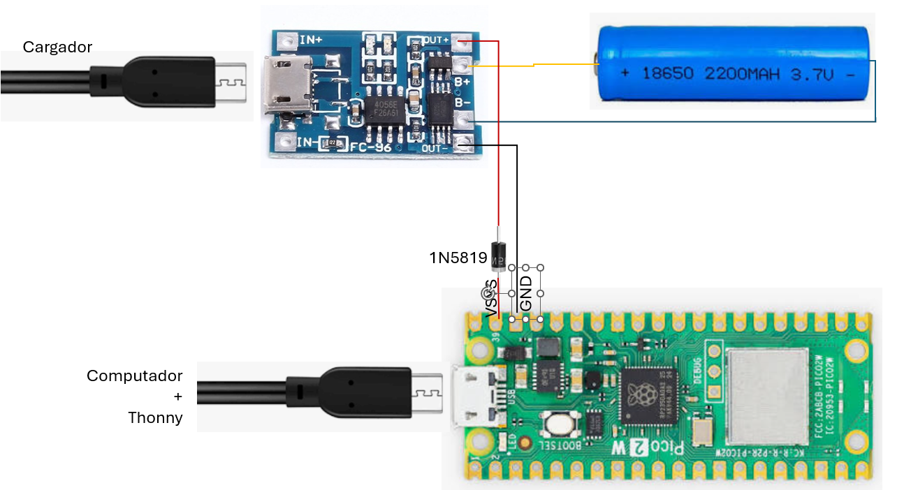
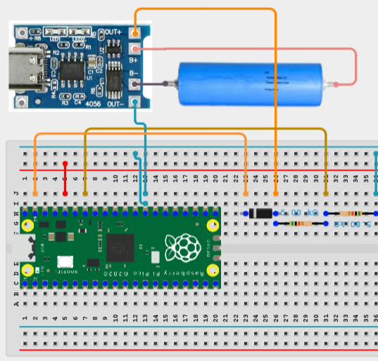

# 05 — Taller: Batería y ADC

## Objetivos

Al finalizar el taller, el estudiante podrá:

* Diferenciar **voltaje, corriente, resistencia, potencia y energía**.
* Reconocer las características básicas de una batería **18650**.
* Explicar la función de un cargador para baterías Li-ion.
* Realizar conexiones básicas en un **protoboard**.
* Comprender el funcionamiento de un **divisor de voltaje**.
* Medir el voltaje de una batería con un multímetro.
* Medir el voltaje de la batería mediante el **ADC del Raspberry Pi Pico**.
* Publicar el voltaje de la batería mediante **PicoROS**.
* Visualizar la medición en **Flet**.
* Dejar el Pico funcionando de manera autónoma mediante `main.py`.

---

# 1. Conceptos eléctricos básicos

Antes de trabajar con la batería, vamos a repasar algunos conceptos de electricidad utilizando una analogía con el agua.

| Electricidad | Analogía hidráulica    | Fórmula  | Unidades |
| ------------ | ----------------|---------|------------ |
| Voltaje      | Presión o altura    | $V$ | voltios (V) |
| Corriente    | Flujo de agua    | $I$ | amperios A) |  
| Resistencia  | Tubo que dificulta el paso  | $R=V/I$ | ohmios (Ω) |
| Potencia de una bateria    | Cuanto flujo puede dar a máxima presión  | $P = V I$ |  vatios (W) |
| Energía de una batería     | Cúanta potencia puede dar en un tiempo dado| $E = V I t$ | joules (J) o Amperios_Hora aMaxVoltaje (Ah) | 

Los materiales con muy poca resistencia se llaman **conductores** y con muy alta resisitencia se llaman **aislantes**

---

# 2. 🧱 Introducción al protoboard

Un **protoboard** se organiza en ileras de materiales condutores para poder interconectar circuitos antes de hacer el PCB.

Las conexiones internas normalmente están organizadas de esta manera:

```text
     ────────────────────────────────
     ────────────────────────────────

      ｜ ｜ ｜ ｜ ｜   ｜ ｜ ｜ ｜ ｜
      ｜ ｜ ｜ ｜ ｜   ｜ ｜ ｜ ｜ ｜
      ｜ ｜ ｜ ｜ ｜   ｜ ｜ ｜ ｜ ｜


      ｜ ｜ ｜ ｜ ｜   ｜ ｜ ｜ ｜ ｜
      ｜ ｜ ｜ ｜ ｜   ｜ ｜ ｜ ｜ ｜
      ｜ ｜ ｜ ｜ ｜   ｜ ｜ ｜ ｜ ｜

     ────────────────────────────────
     ────────────────────────────────
```


La ranura central separa normalmente los dos grupos de contactos.

## Recomendación

Antes de conectar la batería:

1. Identifique las conexiones del protoboard.
2. Utilice el multímetro para comprobar continuidad.
3. Identifique claramente **VCC** y **GND**.
4. Revise el circuito antes de energizarlo.
.
---

# 3. La batería 18650

> ⚠️ Siempre que se almacena energía, ya sea  mecanica (velocidad, altura, elastica), quimica (explosivos) u otras; hay que tener precauciones.

Una batería 18650 es una celda recargable de tecnología **Li-ion**.

El nombre hace referencia a sus dimensiones aproximadas:

* 18 mm de diámetro
* 65 mm de longitud

## Voltaje

Una batería 18650 no tiene siempre el mismo voltaje.

Su voltaje depende de su estado de carga.


Por eso, antes de conectarla al circuito, debemos **medirla**.


| V | Estado |
|---|--------|
| 4.2V | Full carga |
| 3.6V a 3.7V | Valor usual |
| 3.0V | Descargada |

> ⚠️  Sobrecarga continua y severa (4.5V - 5.0V). Daña la bateria y tiene riesgo de explosión.

> ⚠️  Sobredescarga (2.40V a 2.70V). La química interna se destruya de forma irreversible.


## Corriente

Cuando una batería se conecta a un circuito, este se puede ver en cada instante como una resistencia R, y  la corriente I que entrega la batería se calcula por 

$$ V = I/R $$

Las baterias tiene un valor máximo de corriente que puede entregar. Si no se sabe su valor, es mejor no superar el valor "pico" de 2A. Además, para garantizar que no se dañen se debe vigilar la temperatura. 

> ⚠️ Las celdas de iones de litio nunca deben superar los 60 °C.


## Capacidad

La capacidad de una batería suele expresarse en:

$$
mAh
$$

Por ejemplo:

> 4500 mAh

No significa que puede entregar 4.5A por una hora, ya que si la corriente máxima de esa bateria son 2A, no se puede superar este valor. Lo que significa es que si usted utiliza por ejemplo una corriente de 500mA entonces el tiempo que puede alimentar el circuito es t=4500mAh/500ma=9h (9 horas). En condiciones ideales.


Para relacionar capacidad y energía podemos utilizar, de manera aproximada:

$$
E(Wh) \approx V(V) \times Ah
$$

Por ejemplo, una batería de:

* 3.7 V
* 4.5 Ah

tendría aproximadamente:

$$
E \approx 3.7 \times 4.5 = 16.65 Wh
$$

---

# 4. El cargador

Una batería recargable **no debe conectarse directamente a cualquier fuente de 5 V para cargarla**.

El cargador controla el proceso de carga de acuerdo con las características de la batería.

## TP4056

El módulo **TP4056** es muy utilizado para cargar una celda Li-ion de una sola celda.




Algunos módulos TP4056 incluyen además un circuito de protección para la batería.


El cargador y el sistema de alimentación cumplen funciones diferentes.

> ⚠️ Trabajaremos con baterías Li-ion siguiendo las instrucciones indicadas por el profesor.


##  El diodo

Un **diodo** es un componente electrónico que permite que la corriente circule principalmente en **una sola dirección**.

Podemos imaginarlo como una válvula que solo deja pasar el flujo en una dirección indicada por la frjanja blanca.


Un diodo real no es un interruptor perfecto. Cuando conduce presenta una caída de voltaje (de la cual hablaremos) y cuando está en inversa existe una pequeña corriente de fuga (menor a 0.5mA en nuestro caso).

El **diodo Schottky** tiene una **menor caída de tensión directa**. Las referencias 1N5817, 1N5818, 1N5819 a 1 amperio bajan el voltaje en 0.45 V, 0.55 V, 0.60 V respectivamente. 


| Referencia | Tipo     | \(V_{RRM}\) máx. | Corriente directa | Encapsulado típico | Comentario                               |
| ---------- | -------- | ---------------: | ----------------: | ------------------ | ---------------------------------------- |
| **1N5817** | Schottky |             20 V |               1 A | DO-41              | Baja tensión inversa                     |
| **1N5818** | Schottky |             30 V |               1 A | DO-41              | Versión intermedia                       |
| **1N5819** | Schottky |         **40 V** |               1 A | DO-41              | Muy común y adecuada para nuestro taller |
| **1N5820** | Schottky |             20 V |               3 A | DO-201             | Mayor capacidad de corriente             |
| **1N5821** | Schottky |             30 V |               3 A | DO-201             | Mayor capacidad de corriente             |
| **1N5822** | Schottky |         **40 V** |               3 A | DO-201             | Alta corriente                           |
| **SS14**   | Schottky |             40 V |               1 A | SMA                | Alternativa SMD al 1N5819                |

> Los valores de la tabla son valores nominales de referencia. Para un diseño real debemos consultar siempre el **datasheet del fabricante específico**, ya que las características pueden variar entre fabricantes y condiciones de operación.


El diodo en nuestro sistema de alimentación ayuda a aislar la alimentación externa de la alimentación proveniente del USB.


## La carga: alimentación de la Raspberry Pi Pico

La batería es la fuente de energía y la Raspberry Pi Pico es una de las **cargas** que debemos alimentar.

En nuestro robot habrá diferentes cargas:

* Raspberry Pi Pico
* Servomotores
* Motores DC
* Sensores
* LEDs
* Otros módulos electrónicos

Cada una necesita una determinada tensión y consume una determinada corriente.

---

## Alimentación mediante USB

Cuando conectamos la Raspberry Pi Pico al computador mediante USB, el computador proporciona la alimentación.

El voltaje de USB llega al pin **VBUS**.

```text
      PC
      │ USB
      │ 
      ▼ microUSB
PICO─────────┐
│    VBUS    │
│     │      │
│     ▼      │
│   Diodo    │
│   interno  │
│     │      │
│     ▼      │
│    VSYS ◀──── Diodo  ◀──── Fuente
│     │      │  externo       externa
│     │      │
│     ▼      │
│ Regulador  │
│     │      │
│     ▼      │
│   3.3 V    │
⋮             ⋮
```

**VBUS** corresponde a la alimentación proveniente del conector USB.

La Pico también puede alimentarse mediante el pin **VSYS**.

Esto permite utilizar una fuente externa en lugar del USB

La Raspberry Pi Pico dispone de un regulador de tensión que permite obtener aproximadamente **3.3 V** para la electrónica de la placa.

Los GPIO de la Raspberry Pi Pico trabajan con **lógica de 3.3 V**.

> **No debemos aplicar 5 V directamente a un GPIO.**

Esto también es especialmente importante cuando conectemos sensores, módulos y divisores de tensión.

---

##  Consumo de corriente de la Raspberry Pi Pico

La corriente que consume la Pico no es constante. Depende de lo que esté ejecutando y de los periféricos que estén activos.

Como referencia didáctica, podemos pensar en los siguientes órdenes de magnitud:

| Componente        | Consumo típico |      Pico / arranque |
| ----------------- | -------------: | -------------------: |
| Pico W + Wi-Fi    |      80–150 mA |          ~150–200 mA |
| OV7670            |       20–50 mA |               ~50 mA |
| OLED I²C          |       10–30 mA |               ~30 mA |
| Servo ×2          | 100–300 mA c/u |  **500–1000 mA c/u** |
| Motor amarillo ×2 | 150–300 mA c/u | **500–1000+ mA c/u** |
| **Total**         | **~0.6–1.3 A** |         **~2–3.5 A** |

Los valores de motores y servos dependen muchísimo del modelo, carga mecánica y tensión. En particular, el consumo de bloqueo (stall) de los motores puede ser varias veces el consumo mientras giran libremente. Estos valores son **orientativos y no deben utilizarse para dimensionar una fuente sin realizar mediciones**.


##  Crear `main.py`

El objetivo ahora es que el programa del taller anterior que prende y apaga el LED quede almacenado en el Pico como:

```text
main.py
```
El taller es comprobar que el Pico puede funcionar de manera autónoma, desconectado fisicamente del computador.


# 5. ¿Qué es un ADC?

Vimos que el GPIO podia leer un 1 o un 0, estas se conocesn como **señales digitales**. Pero en física hay magnitudes escalares como: temperatura, humedad, presión. Hay sensores que pueden convertir este escalar en un voltaje **análogo** a la magnitud, estas se conocen como **señales análogas**. El **ADC (Analog-to-Digital Converter)** convierte un el voltaje análogo en un valor digital que el microcontrolador puede procesar.

Conceptualmente:

```text
     Sensor
       │
       ▼
Voltaje análogo
       │
       ▼
      ADC
       │
       ▼
Valor digital
       │
       ▼
   Programa
```

En el Raspberry Pi Pico tiene disponible 3 entradas ADC para medir un voltaje (ADC0, ADC1, ADC2).


> **El voltaje aplicado al ADC debe ser entre 0 y 3.3V.**

Por esta razón, no conectaremos directamente la batería al ADC.

---

##  Divisor de voltaje

Un divisor de voltaje utiliza dos resistencias para obtener una fracción del voltaje de entrada.



Seleccione los valores de `R1=R2=5kΩ`.

El voltaje de salida es:

$$
V_{out}=V_{in}\frac{R_2}{R_1+R_2}
$$

## Primera medición: batería con multímetro

Antes de conectar la batería al Pico:

* Configure el multímetro para medir **voltaje DC**.
* Conecte:
   * Terminal negativo (-) del multimetro a out- que es la tierra del circuito digital.
   * Terminal positivo (+) del multimetro a out+

Registre el resultado:

> **Voltaje medido del TP4056: ______ V**

### Preguntas

1. ¿El valor corresponde al voltaje nominal?
2. ¿Por qué puede ser diferente?
3. ¿Qué nos dice este valor sobre el estado de carga?


## Antes de conectar el Pico

Calcule:

$$
V_{out}=V_{battery}\frac{R_2}{R_1+R_2}
$$

Registre el valor calculado:

> **Vout calculado: ______ V**

Después mida `Vout` con el multímetro.

> **Vout medido: ______ V**

Compare ambos valores.

---

## Lectura del ADC con el Pico

El conversor ADC convierte el voltaje entre 0 y 3.3V en un numero entero de 16bits, es decir entre 0 y 65535. Para conventir el numero dado al voltaje, habria que multiplicarlo por 3.3 y luego dividirlo entre 65536.

La clase `AnalogIn` realiza lo siguiente:
1. Configurar el ADC.
2. Se repite periodicamente
2. Leer el ADC.
3. Publicar el valor.

La cual puede ser usada para publicar información de sensores análogos.

```text
Sensor
   │
   ▼
AnalogIn
   │
   │  valor ADC
   ▼
PicoROS / MQTT
   │
   ▼
Flet
   │
   ▼
Voltaje / Temperatura / etc.
```

```python
from machine import ADC
from task import Task


class AnalogIn(Task):

    def __init__(
        self,
        scheduler,
        pubsub,
        gpio,
        period_ms=5000,
    ):
        """
        gpio: string que identifica el GPIO.
              Ejemplo: "GP26", "GP27", "GP28"

        Publica el valor del ADC en:

              AnalogIn_u16/<gpio>

        Payload:

              {"value": 12345}

        period_ms:
              tiempo entre publicaciones.
        """

        self.pubsub = pubsub
        self.gpio = gpio

        # Extraer número del GPIO
        pin_number = int(gpio.replace("GP", ""))

        # Configurar ADC
        self.adc = ADC(pin_number)

        # Topic
        self.topic = "AnalogIn_u16/" + gpio

        print("AnalogIn initialized", self.topic)

        # Inicializar Task
        super().__init__(
            scheduler,
            period_ms=period_ms
        )


    def update(self):

        value = self.adc.read_u16()

        msg = {
            "value": value
        }

        print(
            "AnalogIn_u16:",
            self.gpio,
            value
        )

        self.pubsub.publish(
            self.topic,
            msg
        )


if __name__ == "__main__":
    from watchdog_task import WatchdogTask
    from scheduler import Scheduler
    from wifi_manager import WiFiManager
    from node import Node
    from pubsub_mqtt import PubSubMQTT


    SSID="Ejemplo"       # Change to your WiFi
    PSW_FILE=".env"
    MQTT_BROKER="broker.hivemq.com"
    NODE_NAME='emb_node_0'
    PREFIX='UDFJC/iot_ws/robot0/'

    with open(PSW_FILE) as f:
        password = f.read().strip()

    scheduler = Scheduler()
    print('Scheduler')

    wifi = WiFiManager(
        ssid=SSID,
        password=password
    )

    node = Node(
        prefix=PREFIX,
        node_name=NODE_NAME
    )

    PubSubMQTT(
        client_id=NODE_NAME,
        broker=MQTT_BROKER,
        scheduler=scheduler,
        node=node,
        period_ms=100,
        prefix=PREFIX
    )

    WatchdogTask(
        scheduler=scheduler,
        pubsub=node,
        wifi=wifi,
        period_ms=9000
    )

    print('Initialized')

    AnalogIn(
        scheduler,
        node,
        "GP26"
    )

    scheduler.run()
```

---

# 6 Publicar el voltaje

Una vez que el Pico puede medir correctamente la batería, vamos a convertirlo en un pequeño nodo IoT.

El flujo será:

```text
              TP4056
                 │
                 ▼
          Voltage divider
                 │
                 ▼
              Pico ADC
                 │
                 ▼
              main.py
                 │
                 ▼
              PicoROS
                 │
                 ▼
                Flet
```


En Flet podremos convertir el numero de 16 bits en el votaje de la batería y mostrar:

```text
🔋 Battery

4.08 V
```

---

##  Comparación de mediciones

Complete la siguiente tabla:

| Medición                     | Resultado |
| ---------------------------- | --------: |
| Batería — multímetro         |   _____ V |
| Divisor — valor calculado    |   _____ V |
| Divisor — multímetro         |   _____ V |
| Pico ADC — lectura u16       |   _______ |
| Flet — voltaje publicado     |   _____ V |

### Preguntas finales

1. ¿Por qué no conectamos directamente la batería al ADC?
2. ¿Qué función cumple el divisor de voltaje?
3. ¿Por qué el multímetro y el Pico pueden mostrar valores ligeramente diferentes?
4. ¿Qué sucede con el voltaje de una 18650 a medida que se descarga?
5. ¿Qué diferencia existe entre capacidad en `mAh` y energía en `Wh`?
6. ¿Qué función cumple el TP4056?
7. ¿Por qué `main.py` puede continuar funcionando después de desconectar Thonny?
8. ¿Qué parte del sistema convierte el voltaje analógico en un valor digital?

---


**La meta no es solamente medir una batería.**

La meta es construir el recorrido completo:

> **fenómeno físico → señal eléctrica → ADC → procesamiento → comunicación → dashboard**

