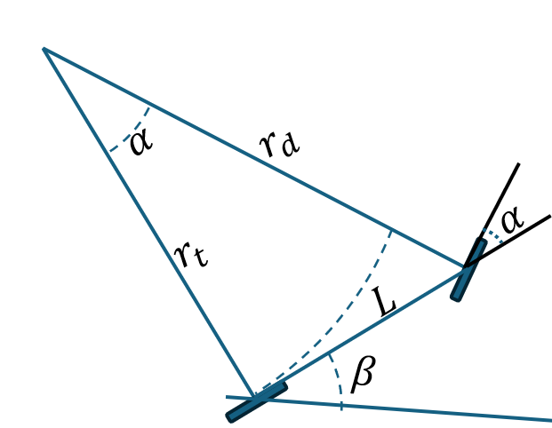
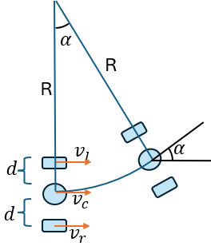
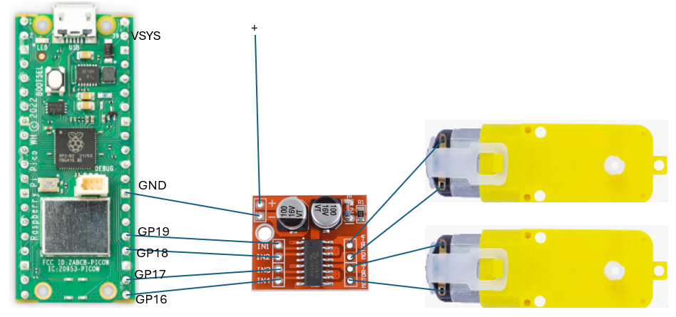

# CAR

## Modelo de la Bicicleta

El modelo de la bicicleta es una simplificación del movimiento de vehículos con dirección delantera, como un carro o un robot tipo coche RC.

* $r_d=\frac{L}{\sin(\alpha)}$
* $r_t=\frac{L}{\tan(\alpha)}$

Si avanza un ángulo $\beta$:
* El arco de la rueda trasera es $\beta r_t$
* El arco de la rueda delantera es $\beta r_d$

El modelo utiliza la rueda trasera, se asume que siempre apunta hacia la rueda delantera.

### Ecuaciones del modelo

El movimiento del vehículo se describe mediante las siguientes ecuaciones diferenciales:

$$
\begin{aligned}
\dot{x} &= v \cdot \cos(\beta) \\
\dot{y} &= v \cdot \sin(\beta) \\
\dot{\beta} &= \frac{v}{L} \cdot \tan(\alpha)
\end{aligned}
$$

### Definiciones

- $ x, y $: posición del vehículo en el plano
- $ \beta $: orientación del vehículo (vector que une las ruedas) respecto al eje X (en radianes)
- $ v $: velocidad lineal del vehículo (en la dirección de la rueda trasera)
- $ \alpha $: ángulo del timón (rueda delantera respecto al cuerpo del vehículo)
- $ L $: distancia entre ejes (entre la rueda delantera y trasera)

### Consideraciones

- La rueda trasera no gira lateralmente, solo avanza en línea recta.
- La rueda delantera gira con ángulo $ \alpha $ y dirige la trayectoria del vehículo.
- Se asume que no hay deslizamiento lateral.

Este modelo es ampliamente usado en simulación y control de robots móviles y vehículos con dirección delantera.

## Cinemática diferencial

Cuando el robot diferencial tiene la misma velocidad en ambas ruedas avanza hacia adelante a la misma velocidad de las ruedas.

Sin embargo, si la velocidad de las ruedas es diferente describe un círculo, en  el dibujo se asume que $v_l$ < $v_r$ y que describe un  círculo de radio R.

El ángulo $\alpha$ que gira el robot sobre su centro corresponde al arco que describe el robot, como se puede observar en la figura. Es importante destacar que $\dot{\alpha}$ representa la velocidad angular con la que el robot gira sobre su propio centro. Además, $\dot{\alpha}$ también se interpreta como la velocidad angular del robot alrededor del centro del círculo que describe su trayectoria.

Asumiendo que cada rueda está a un distancia d del centro entonces se obtienen las siguientes ecuaciones:
* $v_l=\dot{\alpha}(R-d)$  
* $v_c=\dot{\alpha}R$  
* $v_r=\dot{\alpha}(R+d)$  
Al despejar $R$ de la segunda ecuación y reemplazar en las otras dos se obtienen las siguientes ecuaciones conocidas como **cinemática inversa**:

  

* $v_l=v_c-\dot{\alpha}d$
* $v_r=v_c+\dot{\alpha}d$
Despejando  $v_c$ al sumar las ecuaciones, y
$\dot{\alpha}$ y al restarlas, obtenemos las ecuaciones conocidas como **cinemática directa**:
* $v=v_c=(v_r+v_l)/2$
* $w=\dot{\alpha}=(v_r-v_l)/(2d)$

## Realizar las conecciones

## Realizar la clase CAR
La cual se suscribe a los respectivos tópicos para avanzar con una repidez $v$ y una velocidad angular $w$
 durante un tiempo $t$

## Realizar en Flet programa para que envie los siguientes comandos:
* Avance en línea recta un metro
* Genere 1/4 de círculo de un metro de redio
  * a derecha
  * a izquierda
